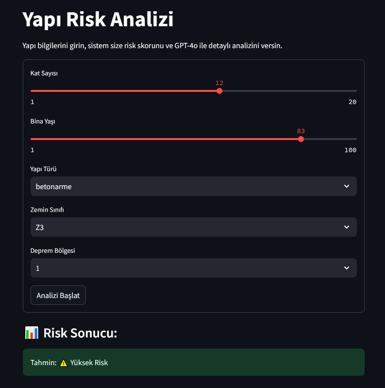
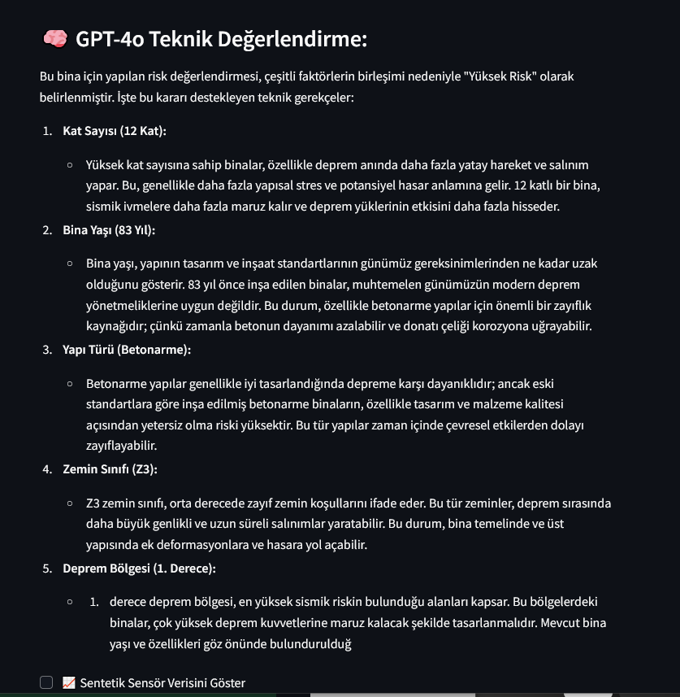

# 🏗️ buildRiskLLM

**Deprem Sonrası Yapı Risk Değerlendirme ve GPT Destekli Açıklama Sistemi**

Yapıdan elde edilen verilerle XGBoost modeli ve GPT-4o kullanarak risk skoru hesaplayan, Streamlit tabanlı görsel arayüze sahip bir yapay zekâ projesidir.

---

## 🎯 Amaç

Türkiye gibi deprem riski yüksek ülkelerde yapı güvenliği hayati öneme sahiptir.  
Bu proje ile:

- Yapıların fiziksel ve çevresel özelliklerine göre deprem sonrası risk skoru tahmin edilir  
- Sentetik sensör verileriyle analizler desteklenir  
- GPT-4o ile anlamlı ve teknik açıklama raporları üretilir  

> Proje, mühendislik kararlarını desteklemeyi ve bina yıkım/güçlendirme süreçlerine bilgi tabanlı katkı sunmayı hedefler.

---

## 🧩 Özellikler

- 🔍 Kat sayısı, yapı yaşı, yapı türü gibi bilgilere göre risk tahmini  
- 📊 XGBoost ile hızlı ve etkili makine öğrenmesi modeli  
- 🤖 GPT-4o ile açıklamalı teknik değerlendirme raporu  
- 🧪 Sentetik sensör verisi üretimi (sıcaklık, nem, sismik veri vb.)  
- 🖥️ Streamlit ile kullanıcı dostu web arayüzü  
- 🧱 SOLID prensiplerine uygun, modüler Python kod yapısı  

---

## ⚙️ Kullanılan Teknolojiler

| Katman     | Teknolojiler                             |
|------------|------------------------------------------|
| Backend    | Python, Scikit-learn, XGBoost, OpenAI API |
| Arayüz     | Streamlit                                |
| Veri       | Sentetik sensör simülasyonu              |
| Mimarî     | Interface (Abstract sınıflar), SOLID     |

---

## 🖼️ Uygulama Görselleri

### Arayüz Ekran Görüntüsü

### Model Akış Diyagramı
